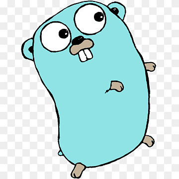

# 🚀 Golang Learning Repository 🚀

This repository is dedicated to learning and practicing Golang (Go programming language). It contains various examples, exercises, and projects to track my learning and progress.

🎯 **Goal:** Master Golang to excel in **backend development**, **DevOps tools**, and **security tools**!



## 📂 Project Structure

```
learning-go/
├── README.md
├── go.work                    # Go workspace file
├── .gitignore
├── docs/                      # Documentation and learning notes
│   ├── learning-notes/
│   ├── best-practices.md
│   └── resources.md
├── fundamentals/              # Basic Go concepts
│   ├── basics/
│   ├── data-structures/
│   ├── concurrency/
│   ├── interfaces/
│   └── error-handling/
├── projects/                  # Practical projects
│   ├── cli-tools/
│   ├── web-servers/
│   ├── microservices/
│   ├── devops-tools/
│   └── security-tools/
├── exercises/                 # Coding exercises and challenges
│   ├── leetcode/
│   ├── codewars/
│   └── interview-prep/
├── libraries/                 # Popular Go libraries exploration
│   ├── gin-gonic/
│   ├── cobra/
│   ├── gorm/
│   └── testify/
├── algorithms/                # Algorithm implementations
│   ├── sorting/
│   ├── searching/
│   └── graph/
├── testing/                   # Testing examples
│   ├── unit-tests/
│   ├── integration-tests/
│   └── benchmarks/
└── scripts/                   # Helper scripts
    ├── setup.sh
    └── build.sh
```

## 🎯 Learning Path

### Phase 1: Fundamentals (Weeks 1-4)
- [ ] Basic syntax and data types
- [ ] Control structures
- [ ] Functions and methods
- [ ] Structs and interfaces
- [ ] Error handling
- [ ] Goroutines and channels

### Phase 2: Standard Library (Weeks 5-6)
- [ ] HTTP package
- [ ] JSON handling
- [ ] File I/O
- [ ] Testing framework
- [ ] Context package

### Phase 3: Web Development (Weeks 7-10)
- [ ] Building REST APIs
- [ ] Middleware
- [ ] Database integration
- [ ] Authentication/Authorization
- [ ] WebSocket connections

### Phase 4: DevOps & Tools (Weeks 11-14)
- [ ] CLI applications with Cobra
- [ ] Docker containerization
- [ ] Monitoring and logging
- [ ] Configuration management
- [ ] CI/CD pipelines

### Phase 5: Security Tools (Weeks 15-18)
- [ ] Cryptography implementations
- [ ] Network security tools
- [ ] Vulnerability scanners
- [ ] Log analysis tools
- [ ] Authentication systems

## 🛠️ Projects Roadmap

### Beginner Projects
1. **CLI Calculator** - Basic arithmetic operations
2. **File Organizer** - Organize files by type/date
3. **URL Shortener** - Simple web service
4. **Todo API** - REST API with CRUD operations
5. **Log Parser** - Parse and analyze log files

### Intermediate Projects
1. **Chat Server** - WebSocket-based chat application
2. **Container Monitor** - Docker container monitoring tool
3. **Load Balancer** - Simple HTTP load balancer
4. **Metrics Collector** - System metrics collection tool
5. **Password Manager** - Secure password storage

### Advanced Projects
1. **Microservice Framework** - Custom microservice toolkit
2. **Security Scanner** - Network vulnerability scanner
3. **Distributed Cache** - Redis-like caching system
4. **API Gateway** - Request routing and authentication
5. **Container Orchestrator** - Mini Kubernetes-like tool

## 📚 Resources

### Books
- [ ] "The Go Programming Language" by Alan Donovan
- [ ] "Go in Action" by William Kennedy
- [ ] "Concurrency in Go" by Katherine Cox-Buday
- [ ] "Security with Go" by John Daniel Leon

### Online Resources
- [ ] [Go Tour](https://tour.golang.org/)
- [ ] [Go by Example](https://gobyexample.com/)
- [ ] [Effective Go](https://golang.org/doc/effective_go.html)
- [ ] [Go Blog](https://blog.golang.org/)

### YouTube Channels
- [ ] [Golang Dojo](https://www.youtube.com/c/GolangDojo)
- [ ] [Just for Func](https://www.youtube.com/c/JustForFunc)
- [ ] [TutorialEdge](https://www.youtube.com/c/TutorialEdge)

## 🔧 Development Setup

### Prerequisites
- Go 1.21+ installed
- VS Code with Go extension
- Git configured
- Docker installed (for containerization projects)

### Quick Start
```bash
# Clone the repository
git clone <your-repo-url>
cd learning-go

# Initialize Go workspace
go work init

# Add modules as you create them
go work use ./projects/project-name

# Run tests
go test ./...

# Build all projects
./scripts/build.sh
```

## 📊 Progress Tracking

- **Current Focus:** [Update with current learning topic]
- **Completed Projects:** [List completed projects]
- **Next Milestone:** [Next goal or project]
- **Learning Hours:** [Track study time]

## 🤝 Contributing

This is a personal learning repository, but feel free to:
- Suggest improvements
- Share learning resources
- Provide code reviews
- Report issues

## 📝 Notes

- Each project should have its own `go.mod` file
- Include comprehensive README files for each project
- Write tests for all code
- Document learnings and challenges
- Use conventional Go project structure
